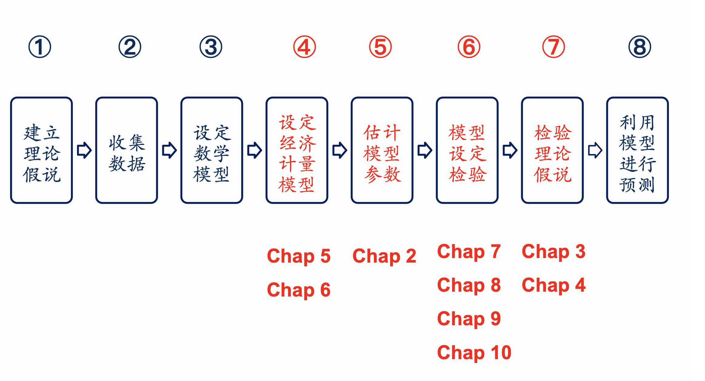

```{r setup, include=FALSE}
knitr::opts_chunk$set(echo = TRUE,comment="")
```


## Chapter 1 Outline

* **1.1 What is Econometrics?**
* **1.2 Why Study Econometrics?**
* **1.3 The Methodology of Econometrics**
* **Course Info**
* **Data Sources**

---

## 1.1 What is Econometrics?

* **Econometrics**: 经济计量学（计量经济学）
  * **Narrow sense**: economic measurement（经济度量）
  * **Broader sense**: ......
* **Biometrics**: 生物计量学

---

## 1.1 What is Econometrics?

* **经济计量学**：利用经济理论、数学、统计推断等工具对经济现象进行分析的一门社会科学。

> *"Econometrics may be defined as the social science in which the tools of economic theory, mathematics, and statistical inference are applied to the analysis of economic phenomena."*  
> — Arthur S. Goldberger (1964), *Economic Theory*

---

### Two branches of Econometrics

* **Theoretical econometrics**（理论经济计量学）
* **Applied econometrics**（应用经济计量学）

---

## 1.2 Why Study Econometrics?

* **Validate economic theory**
  * 验证经济理论 / 假说推断
* **Provide numerical estimates**
  * 提供具体的数值估计

---

## 1.3 The Methodology of Econometrics

1. **Creating a statement of theory or hypothesis**（建立理论或假说）
2. **Collecting Data**（收集数据）
3. **Specifying the mathematical model of theory**（设定理论的数学模型）
4. **Specifying the econometric model**（设定经济计量学模型）

---

5. **Estimating the parameters of the chosen econometric model**（估计模型参数）
6. **Model specification testing**（模型设定检验）
7. **Testing the hypothesis derived from the model**（检验模型导出的假说）
8. **Using the model for prediction or forecasting**（利用模型进行预测）

---

### 案例：财务总监薪酬分析

* **数据来源**：上市公司财务总监薪酬及个人特征（CSMAR 数据库）
* **关注特征**：性别？年龄？学历？行业？经营绩效？
* **统计分析方法**：
  * 描述性统计分析
  * 推断性统计分析
* **思考**：如何选择适当的统计分析方法？

---

### 薪酬分析：经济计量学的视角

* **经济理论**（指导变量选取与关系假设）
* **数学**（建立函数形式表达式）
* **统计推断**（利用样本数据估计与检验）

---

### 案例一 · Step 1: 建立假说

* **理论假说**：工资由劳动力的人力资本决定
  * 资历（年龄）
  * 学历
* **研究目标**：
  * 资历对工资的影响效应是什么？如何量化？
  * 学历对工资的影响效应是什么？如何量化？

---

### 案例一 · Step 2: 收集数据 (CSMAR)

* **数据库**：国泰安 CSMAR 数据库 $\rightarrow$ 公司研究系列 $\rightarrow$ 治理结构 $\rightarrow$ 高管个人资料文件 / 年薪区间文件

---

### 案例一 · Step 2: 数据样本

* **样本筛选**：2017 年年报，职位为财务总监（代码 `00380000A0`），样本容量 1095 家公司（剔除信息不全、任职不足一年及薪酬最低/最高各 5% 极端值）。

| 证券代码 | 姓名 | 性别 | 年龄 | 教育背景 | 职称 | 薪酬总额 |
| :--- | :--- | :--- | :--- | :--- | :--- | :--- |
| 000008 | 王守俊 | 男 | 44 | 3 | | 991,900 |
| 000010 | 李卉 | 男 | 33 | 3 | | 467,200 |
| 000016 | 李春雷 | 男 | 45 | 4 | | 1,507,000 |
| 000019 | 王志萍 | 女 | 47 | 3 | 会计师 | 448,900 |
| 000022 | 张方 | 男 | 53 | 3 | | 800,000 |
| 000023 | 张慧 | 男 | 35 | 3 | 高级会计师 | 281,700 |
| 000028 | 魏平孝 | 男 | 54 | 4 | 会计师 | 1,575,000 |

---

### 案例一 · 变量定义与编码说明

* **教育背景 (Education)**：
  * `1` = 中专及中专以下
  * `2` = 大专
  * `3` = 本科
  * `4` = 硕士研究生
  * `5` = 博士研究生
  * `6` = 其他
* **职位代码**：`00380000A0`（末两位字母 `A` 代表财务方向）

---

### 案例一 · Step 3: 设定数学模型

* **被解释变量**：$Salary$
* **解释变量**：$Age$, $Education$
* **函数形式**：
  $$Salary = B_0 + B_1 Age + B_2 Education$$

---

### 案例一 · Step 4: 设定计量经济学模型

* **数学模型**：
  $$Salary = B_0 + B_1 Age + B_2 Education$$
* **计量经济学模型**（引入随机误差项 $u$）：
  $$Salary = B_0 + B_1 Age + B_2 Education + u$$
* **参数符号预期**：
  * $B_1 > 0$（年龄越长，资历越深，工资越高）
  * $B_2 > 0$（学历越高，工资越高）

---

### 案例一 · Step 5: 估计模型参数

* **估计方法**：普通最小二乘法 (OLS)
* **软件实现**：Excel / Eviews / Stata / R
* **估计的回归方程**：
  $$\widehat{Salary}_i = -157635.2 + 5604.7 Age_i + 118184.4 Education_i$$

---

### 案例一 · Step 6: 模型诊断 (Adequacy)

* **函数的设定形式是否正确？**
  * 工资和年龄之间是纯线性关系吗？
  * 是否应该使用半对数模型：$\ln(Salary)_i = B_0 + B_1 Age_i + B_2 Education_i + u_i$？（*见第 5 章*）
* **模型是否存在遗漏变量？**
  * 性别、行业、地区等。

---

### 案例一 · Step 6: 计量检验对应章节

* **第 7 章**：模型选择（标准与设定检验）
* **第 8 章**：多重共线性 (Multicollinearity)
* **第 9 章**：异方差 (Heteroskedasticity)
* **第 10 章**：自相关 (Autocorrelation)

---

### 案例一 · Step 7: 检验理论假说

* **模型形式**：$Salary = B_0 + B_1 Age + B_2 Education + u$
* **检验对待估参数的理论假说**：
  * $H_0: B_1 \le 0 \quad \text{vs} \quad H_1: B_1 > 0$
  * $H_0: B_2 \le 0 \quad \text{vs} \quad H_1: B_2 > 0$
* *具体检验方法参见第 3 章 & 第 4 章单个参数的假设检验*。

---

### 案例一 · Step 8: 模型预测与应用

* **预测情境**：预测年龄 40 岁、硕士研究生学历（$Edu = 4$）的财务总监薪酬。
* **带入回归模型**：
  $$\begin{aligned}
  \widehat{Salary} &= -157635.2 + 5604.7 \times Age + 118184.4 \times Education \\
  &= -157635.2 + 5604.7 \times 40 + 118184.4 \times 4 \\
  &= 539,290.4 \text{ 元}
  \end{aligned}$$

---

### 案例一 · 深度思考与拓展

* 模型对现实现象的解释程度如何？这是一个好模型吗？
* **关于学历的测度**：分类赋值（1-5）是否合理？
* **关于资历的测度**：
  * 生理年龄 vs 真实工龄？
  * 现职位任职时长？
  * 行业任职经历？

---

### 案例二：穗京直航机票价格影响因素

* **研究主题**：穗京直航经济舱机票价格影响因素分析
* **研究对象与样本**：穗京直航航班，2020.11.8 查询的未来一周共 256 个航班数据。
* **主要影响因素**：
  * 提前订票天数
  * 执飞机型
  * 航班起飞时点
  * 航空公司品牌

---

### 案例二 · 变量定义 (一)

* **Price**：经济舱机票价格（单位：元）
* **Advance**：提前购票天数（单位：天）。以 2020 年 11 月 8 日为基准，若购 11 月 9 日票则 $Advance = 1$，11 月 15 日票则 $Advance = 7$。
* **Takeoff**：航班起飞时点（24 小时制折算）。例如 10:30 $\rightarrow 10.5$；14:00 $\rightarrow 14.0$；23:15 $\rightarrow 23.25$。

---

### 案例二 · 变量定义 (二)

* **Large**（虚拟变量）：$Large = 1$ 表示大型客机执飞；$Large = 0$ 表示中小型客机执飞。
* **China**（虚拟变量）：$China = 1$ 表示中国国航执飞；$China = 0$ 表示其他航司。
* **Southern**（虚拟变量）：$Southern = 1$ 表示南方航空执飞；$Southern = 0$ 表示其他航司。

---

### 案例二 · Step 1: 建立理论假说

* **假说 1（差别化定价理论）**：越早购票，机票价格越优惠。
* **假说 2（成本与效用理论）**：航班起飞时点越便利，票价越贵；早晨和深夜起飞的航班价格较低。
* **假说 3（市场竞争理论）**：市场份额大的大型航空公司票价高于中小航空公司。

---

### 案例二 · Step 2: 收集数据

* **数据来源**：携程网（爬虫抓取网页数据）
* **核心字段**：机票价格、提前购票天数、起飞时点、起飞日是星期几、机型大小、航空公司

---

### 案例二 · 样本数据预览

| ID | price | accurate | takeoff | airplane | Size | company | flight | Weekday | weekend |
| :--- | :--- | :--- | :--- | :--- | :--- | :--- | :--- | :--- | :--- |
| 中国联航KN5900 | 758 | 93% | 21:35 | 波音737-800(中) | 0 | 中国联航 | KN5900 | 1 | 0 |
| 中国国航CA1310 | 780 | 87% | 8:10 | 波音777-300ER(大)| 1 | 中国国航 | CA1310 | 2 | 0 |
| 中国国航CA1352 | 780 | 87% | 12:30| 波音777-200(大) | 1 | 中国国航 | CA1352 | 2 | 0 |
| 海南航空HU7810 | 800 | 53% | 22:20| 78A(大型) | 1 | 海南航空 | HU7810 | 1 | 0 |
| 东方航空MU5182 | 920 | 97% | 11:40| A330-300(大) | 1 | 东方航空 | MU5182 | 2 | 0 |
| 中国联航KN5830 | 937 | 83% | 17:15| 波音737(中) | 0 | 中国联航 | KN5830 | 1 | 0 |

---

### 案例二 · Step 3: 设定数学模型

$$\begin{aligned}
Price_i = & B_0 + B_1 Takeoff_i + B_2 Takeoff_i^2 + B_3 Advance_i \\
          & + B_4 Large_i + B_5 Southern_i + B_6 China_i
\end{aligned}$$

---

### 案例二 · Step 4: 设定计量经济学模型

$$\begin{aligned}
Price_i = & B_0 + B_1 Takeoff_i + B_2 Takeoff_i^2 + B_3 Advance_i \\
          & + B_4 Large_i + B_5 Southern_i + B_6 China_i + u_i
\end{aligned}$$

* $u_i$：随机误差项
* 二次项引入：反映非线性时间规律（*第 5 章*）
* 虚拟变量引入：量化属性特征（*第 6 章*）

---

### 案例二 · Step 5: OLS 参数估计表

**Dependent Variable: PRICE | Method: Least Squares | Included observations: 256**

| Variable | Coefficient | Std. Error | t-Statistic | Prob. |
| :--- | :--- | :--- | :--- | :--- |
| **C** | 265.7471 | 203.4456 | 1.306232 | 0.1927 |
| **TAKEOFF** | 191.7269 | 28.14661 | 6.811724 | 0.0000 |
| **TAKEOFF^2** | -7.001507 | 0.948489 | -7.381750 | 0.0000 |
| **ADVANCE** | -91.76225 | 7.298602 | -12.57258 | 0.0000 |
| **LARGE** | 124.4946 | 45.08694 | 2.761211 | 0.0062 |
| **SOUTHERN** | 342.2230 | 41.37619 | 8.271013 | 0.0000 |
| **CHINA** | 263.7842 | 46.19458 | 5.710284 | 0.0000 |

* $R^2 = 0.5803$, $\text{Adjusted } R^2 = 0.5702$, $F = 57.39$, $P(F) = 0.0000$

---

### 案例二 · Step 6: 模型诊断要点

* 模型设定误差检验（*第 7 章*）
* 多重共线性诊断（*第 8 章*）
* 异方差检验（*第 9 章*）
* 自相关检验（*第 10 章*）

---

### 案例二 · Step 7: 假说 1 检验

* **假说 1**：越早购票，机票价格越优惠（$B_3 < 0$）。
* **实证检验**：
  * $ADVANCE$ 的回归系数为 **-91.76**（$P < 0.001$）。
  * **经济含义**：在控制其他变量不变的情况下，**提前 1 天购票，机票价格平均便宜约 92 元**。
  * 实证结果支持假说 1。

---

### 案例二 · 起飞时点非线性极值求解

$$\widehat{Price} = 265.75 + 191.73 Takeoff - 7.002 Takeoff^2 - 91.76 Advance + \dots$$

* 对 $Takeoff$ 求一阶导数令其等于 0：
  $$\frac{dPrice}{dTakeoff} = 191.727 - 2 \times 7.002 \cdot Takeoff = 0$$
  $$Takeoff^* = \frac{191.727}{2 \times 7.002} = \mathbf{13.7 \text{ 时}} \quad (13\text{点}42\text{分})$$

---

### 案例二 · 起飞时点与票价曲线图

{width=65% fig-align="center"}

* 曲线呈倒 U 型：**13:42 起飞的航班票价最高**；起飞时点距离 13:42 越早或越晚，票价越便宜。

---

### 案例二 · Step 7: 假说 2 检验

* **假说 2**：起飞时点存在黄金时段，早晚低价（$B_1 > 0, B_2 < 0$）。
* **实证检验**：
  * $TAKEOFF$ 系数为正，$TAKEOFF^2$ 系数显著为负。
  * 实证分析结论完全支持假说 2。

---

### 案例二 · Step 8: 模型预测应用

* **设定情境**：提前 7 天购票（$Advance=7$），起飞时间 18 点（$Takeoff=18$），中型客机（$Large=0$），南方航空（$Southern=1, China=0$）。
* **计算预测值**：
  $$\begin{aligned}
  \widehat{Price} = & 265.75 + 191.73(18) - 7.002(18^2) - 91.76(7) \\
                    & + 124.49(0) + 342.22(1) + 263.78(0) \\
  \approx & \mathbf{1148 \text{ 元}}
  \end{aligned}$$

---

### 案例三

* **论文题目**：*Running with a Mask? The Effect of Air Pollution on Marathon Runners' Performance*

* **利用中国 37 个城市 55 场马拉松超过 30 万跑者的大样本，评估空气污染（AQI）对户外高强度劳动/运动生产力（完赛时间）的影响效应。

---

### Step 1: 建立理论或假说 (Hypothesis)

* **经济学与健康学视角**：
  * 空气污染物（$PM_{2.5}, PM_{10}, SO_2, NO_2, CO, O_3$）在短期暴露下会导致人体肺功能下降、心律不齐、呼吸系统受损及焦虑等心理负效应。
  * 高强度户外活动时呼吸量急剧上升，空气污染会直接降低户外劳动者/运动员的即期生产力（Short-run Productivity。
  
---

* **核心理论假说**：
  * **假说 1**：空气质量越差（AQI 越高），跑者的完赛耗时越长（生产力下降。
  * **假说 2（非线性效应）**：重度污染天气对成绩的边际损害递增。
  * **假说 3（异质性效应）**：专业跑者、年轻跑者与半马/全马跑者对污染的弹性存在差异。

---

### Step 2: 收集数据 (Collecting Data)

论文构建了一个涵盖“微观个体 + 赛事特征 + 宏观环境”的微观横截面与面板数据集

* **1. 跑者与比赛成绩数据**：
  * **来源**：中国田径协会（CAA）官方网站（`www.runchina.org.cn`。
  * **样本**：2014–2015 年 37 个城市举办的 55 场马拉松比赛，共 **314,341 名国内跑者**（全马 172,523 人，半马 141,818 人）。
  * **变量**：净完赛时间（秒）、性别、年龄段、全马/半马标签。

---

* **2. 空气质量数据 (AQI)**：
  * **来源**：国家环境保护部（MEP）数据中心。
  * **变量**：比赛日日均 AQI（28–289）及比赛时段（6:00–15:00）逐时 6 种污染物浓度。
  
* **3. 气象控制变量**：
  * **来源**：彭博全球天气数据库（Bloomberg）。
  * **变量**：降水量、气温、风速、相对湿度。

---

### Step 2: 数据特征与类型归属

| 指标变量 | 均值 (Mean) | 标准差 (SD) | 极小值 | 极大值 | 数据类型归属 |
| :--- | :--- | :--- | :--- | :--- | :--- |
| 全马完赛时间 (秒) | 16,581 (4h36m) | 2,701 | 8,301 | 24,337 | **横截面微观数据**|
| 跑者性别 (女性占比) | 19% | 0.39 | 0 | 1 | 虚拟变量|
| 跑者年龄 (18-34岁占比) | 50% | 0.50 | 0 | 1 | 虚拟变量|
| 比赛日 AQI 指数 | 102.19 | 58.86 | 28.00 | 289.00 | 连续变量|
| 比赛时段 $PM_{2.5} (\mu g/m^3)$ | 73.89 | 60.89 | 5.89 | 268.57 | 超出 WHO 标准 3 倍|

* **数据结构拓展**：除了全样本截面分析外，作者还将跨场次参赛的同一姓名/性别/年龄跑者匹配，构造了 **个体面板数据（Runner Panel Data）**。

---

### Step 3: 设定理论的数学模型

设定完赛时间（$Finishtime$）与空气质量（$AQI$）、气象环境（$W$）以及跑者个体特征（$X$）之间的**双对数（Log-Log）函数形式**：

$$\ln(Finishtime_{ijt}) = f(\ln(AQI)_{jt}, W_{jt}, X_i)$$

* **采用双对数形式的经济学理由**：
  * 自变量系数 $\beta_1$ 可以直接解释为 **完赛时间的空气污染弹性（Elasticity）**，即 AQI 每恶化 1%，完赛时间平均增加 $\beta_1\%$。

---

### Step 4: 设定计量经济学模型

加入不可观测因素误差项 $\epsilon_{ijt}$ 与城市固定效应 $\alpha_j$：

$$\ln(Finishtime)_{ijt} = \alpha_j + \beta_1 \ln(AQI)_{jt} + \beta_2 W_{jt} + \beta_3 X_i + \delta \cdot Year2015 + \sum \gamma_m Month_m + \epsilon_{ijt}$$

* **因变量**：$\ln(Finishtime)_{ijt}$（城市 $j$ 第 $t$ 天跑者 $i$ 的完赛时间对数）。
* **核心自变量**：$\ln(AQI)_{jt}$（空气质量指数对数）。
* **控制变量**：
  * $W_{jt}$：降水量、温度、风速、相对湿度；
  * $X_i$：女性虚拟变量、5 个年龄组虚拟变量、全马/半马虚拟变量；
  * $\alpha_j$：**城市固定效应**（吸收各赛道海拔、起伏、弯道等不随时间改变的地理特征）；
  * $Month_m$：双月虚拟变量（控制季节性规律）；
  * $\epsilon_{ijt}$：随机误差项。
* **待估参数预期**：$\beta_1 > 0$（污染显著拖慢成绩）。

---

### Step 4: 因果识别逻辑 (Causal Identification)

* **外生性来源（准自然实验）**：
  * 马拉松通常需**提前数月报名缴费**（如北京提前 2 个月、武汉提前 3 个月）。
  * 跑者虽能预期某城市的季节性平均气候，但**无法提前预测比赛当天的瞬时 AQI 随机波动**。
  * 在控制了城市固定效应与季节效应后，比赛日空气质量对跑者而言具有**严格外生性**。

---

### Step 5: 估计模型参数 (OLS 与固定效应)

**全样本基准回归结果（因变量：$\ln(Finishtime)$，聚类标准误于赛事层面）**：

| 解释变量 | (1) 基础模型 | (2) 引入气象变量 | (3) 引入人口特征 (基准) | (4) 线性水平模型 |
| :--- | :--- | :--- | :--- | :--- |
| **$\ln(AQI)$** | **0.0273**$^{*}$ | **0.0408**$^{***}$ | **0.0408**$^{***}$ | — |
| | (0.0114) | (0.0030) | **(0.0026)** | |
| **$AQI$ (线性值)** | — | — | — | **2.7311**$^{***}$ (0.4434) |
| 全马虚拟变量 | 0.6731$^{***}$ | 0.6731$^{***}$ | 0.6944$^{***}$ | 8216.76$^{***}$ |
| 女性跑者 (Female) | — | — | 0.0919$^{***}$ | 988.75$^{***}$ |
| 降水量 (Precipitation) | — | 0.0282$^{***}$ | 0.0280$^{***}$ | 134.29 |
| 气温 (Temperature) | — | 0.0049$^{***}$ | 0.0047$^{***}$ | 85.99$^{***}$ |
| **Adjusted $R^2$** | **0.8299** | **0.8306** | **0.8417** | **0.8107** |
| **样本量 $N$** | 314,341 | 314,341 | 314,341 | 314,341 |

---

### Step 6: 模型设定与诊断检验 (Adequacy & Robustness)

论文进行了极其严密的高阶计量检验，对应课件 Chap 5-10 的检验思想[cite: 1]：

* **1. 误差项相关性处理（Chap 10 自相关思想拓展）**：
  * 同一场比赛跑者的误差项可能受赛事组织影响而相关，标准误在 **比赛场次层面进行聚类调整（Clustered SE）**。
* **2. 遗漏变量与个体固定效应模型（Runner FE）**：
  * 引入跑者个体固定效应 $\mu_i$ 消除基因、心理预期、训练水平等不可观测遗漏变量的影响，$\beta_1$ 依然在 1% 水平上显著正相关（弹性为 0.0054~0.0071）。
* **3. 非线性函数形式检验（Chap 5）**：
  * 加入 $AQI^2$ 二次项以及不同污染等级虚拟变量（蓝天 vs 重度污染），证实重污染天（$AQI>200$）对跑者的负面冲击是轻度污染天的 **3 倍**（增加 7.65% 完赛耗时）。
* **4. 测度误差稳健性检验**：
  * 使用比赛时段 6:00–15:00 的逐时平均 AQI 及各单一污染物（$PM_{2.5}, PM_{10}, SO_2$）浓度重新估计，结果完全一致。

---

### Step 7: 检验理论假说 (Testing Hypotheses)

* **假设检验设定**：
  * $H_0: \beta_1 \le 0 \quad \text{vs} \quad H_1: \beta_1 > 0$
* **实证检验结论**：
  * $t = \frac{0.0408}{0.0026} = 15.69 \quad (p < 0.001)$，在 1% 统计水平上强力拒绝原假设，**完全支持假说 1**。
* **异质性检验结果（分样本回归）**：
  * **全马 vs 半马**：半马弹性（0.0494）高于全马（0.0274）。
  * **顶尖专业跑者**：对前 20 名精英跑者，污染弹性依然达到 **0.0286** 且显著。
  * **分位数回归 (Quantile)**：全马跑者中，前 10% 的快速跑者受污染冲击是后 10% 慢跑者的 **3 倍**。

---

### Step 8: 利用模型进行预测与经济学解释

基于基准回归模型 $\widehat{\beta_1} = 0.0408$ 进行经济效应数值推演：

* **案例一：普通全马跑者预测（2014 北京马拉松真实场景）**：
  * 全国基准日均 $AQI = 102$，全马平均耗时 16,581 秒（4 小时 36 分）。
  * 2014 北马当天遭遇严重雾霾（$AQI = 289$）：
  $$\Delta \ln(AQI) = \ln(289) - \ln(102) \approx 1.0415 \quad (+104.15\%)$$
  $$\Delta Finishtime = 16581 \times (0.0408 \times 1.0415) \approx \mathbf{1243 \text{ 秒（约 20.7 分钟）}}$$
* **案例二：前 20 名精英跑者经济损失测算**：
  * 精英跑者平均耗时将增加 **10.2 分钟**。
  * 北马冠军奖金 4 万美元（要求跑进 2:09:00），亚军与冠军时间仅差 1 分钟奖金即缩水 2 万美元；
  * **结论**：空气污染造成的完赛时间延误具有极其高昂的经济与名次机会成本。

---

### 文献对实证示

* **1. 严谨的因果识别**：寻找现实制度中的“外生性时滞”（提前报名）解决内生性反向因果问题。
* **2. 灵活运用数据类型**：将大样本横截面（Cross-sectional）与个体面板（Panel Data）巧妙结合，有效控制个体固定效应。
* **3. 扎实的研究步骤**：从经济学理论假说出发，完成“设定 $\rightarrow$ 估计 $\rightarrow$ 诊断 $\rightarrow$ 检验 $\rightarrow$ 预测”的全流程闭环[cite: 1, 2]。


---

### Methodology of Econometrics

{width=45% fig-align="center"}

---

### 小组作业：开展经济计量实证研究

* **结合选题深入讨论**：
  * 核心理论假说是什么？
  * 经济计量模型的表达式如何构建？
  * 对模型中的待估参数有何理论预期？
  * 如何科学测度因变量与自变量？
  * 通过何种渠道收集样本数据？

---

### 往届优秀学生课题参考

* 麦当劳门店数量影响因素分析（19金融3 陈沁雪）
* 广州酒店客房价格影响因素分析（19金融3 陶羽）
* 手机价格影响因素分析（19金融4 黄锦毅）
* 欧洲杯球员评分影响因素分析（19金融4 林梓翰）
* 二手车价格影响因素分析（19金融4 张培芸）

---

### DATA

* **横截面数据 (Cross-sectional data)**
* **时间序列数据 (Time Series data)**
* **合并数据 (Pooled data)**
* **面板数据 (Panel data)**

---

#### Pooled data (合并数据)

* **定义**：包含相对较少数量的截面单元，在一段时间内的跨期混合观测。
* **示例**：10 个国家在连续 20 年间的 GDP 序列。

---

#### Panel data (面板数据)

* **定义**：跨时间观测**大量**截面单元（观测单元数远超观测期数，即大 $N$ 小 $T$）。
* **特点**：跟踪同一批个体在时间维度上的动态变化。

---

#### 面板数据实例：150 个城市犯罪记录面板

| city | year | murders | population | police |
| :--- | :--- | :--- | :--- | :--- |
| 1 | 1986 | 5 | 350,000 | 440 |
| 1 | 1990 | 8 | 359,200 | 471 |
| 2 | 1986 | 2 | 64,300 | 75 |
| 2 | 1990 | 1 | 65,100 | 75 |
| ... | ... | ... | ... | ... |
| 150 | 1986 | 25 | 543,000 | 520 |
| 150 | 1990 | 32 | 546,200 | 493 |

---

### Terminology 

* **parameters**（参数）
  * **intercept**（截距）
  * **slope**（斜率）
* **error term**（随机误差项 / 误差项）
* **dependent variable**（应变量 / 因变量 / 被解释变量）
* **independent variable**（自变量 / 独立变量 / 解释变量）

---

### Chapter 1 Summary

* **Methodology of Econometrics**
* **Types of Data**：
  * Time series
  * Cross-sectional
  * Pooled Data / Panel Data
* **Terminology**：
  * Intercept, Slope, Error term, Dependent / Independent variables

---

## Course Info

* **初级 / 应用经济计量学**
* **教学侧重**：
  * 不作复杂的纯数理统计推导与公式证明要求；
  * 不强调手工繁琐计算；
  * 重视实际问题分析与现代统计软件实现。

---

### 课程目标

* 运用经济计量方法科学分析现实经济与管理问题；
* 熟练利用统计与计量软件开展实证建模分析。

---

### 课程安排

* **学时与学分**：64 学时，4学分
* **教学形式**：
  * 理论新课 + 随堂练习
  * 习题讲评、答疑
  * EViews操作
  * 案例讨论


---

### 学习方法建议

* **精读教材 (Textbook) + 笔记**
* **练习 + 软件应用实操**
* **案例分析与研讨**
* **积极参与课堂提问与交流**

---

### 主要选用教材

* **教材**：
  * Damodar N. Gujarati & Dawn C. Porter, *Essentials of Econometrics* (4th edition), McGraw-Hill, 2009.

{width=45% fig-align="center"}

---

### 推荐参考书目清单

* Stock & Watson, *Introduction to Econometrics* (Global Edition)

* Wooldridge, *Introductory Econometrics: A Modern Approach* (6th ed.)

* 伍德里奇, 《计量经济学导论：现代观点》（中文第六版）

---

* Kleiber & Zeileis, *Applied Econometrics with R*


* Roberto Pedace, *Econometrics For Dummies*
* 洪永淼, 《高级计量经济学》（研究生教学用书）


---

## Data Sources

* **宏观数据 (Macro Data)**
* **微观数据 (Micro Data)**

---

### 宏观数据主要来源

* **国家统计局**：`http://www.stats.gov.cn/`
* **政府各部委公开数据**：`http://www.gov.cn/`
* **联合国统计司**：`http://data.un.org/`
* **世界银行公开数据**：`https://data.worldbank.org`

---

### 国家政府部委公开网站资源

* 外交部、发展改革委、教育部、科技部、公安部、民政部、司法部、财政部、环保部、住建部、交通运输部、水利部、农业部、商务部、卫计委、人民银行、审计署、国资委、海关总署、国家知识产权局等。

---

### 高校图书馆订购数据库

* **宏观数据库（国家、省、市、县多级）**：
  * **EPS 全球数据库**
  * **国研网 (DRCNET)**
  * **中国知网 (CNKI) 统计数据平台**
* **微观数据库（上市公司/金融市场）**：
  * **CSMAR 国泰安经济金融数据库**
  * **RESSET (锐思) 金融研究数据库**

---

### 数据库访问规范提示

* **IP 访问限制**：务必在校园网 IP 地址范围内访问；
* **正规入口**：从大学图书馆主页 $\rightarrow$ 电子资源 $\rightarrow$ 中文/外文数据库检索进入；
* **注意**：避免通过公共搜索引擎直接搜索第三方链接访问。

---

### EPS 全球统计数据平台

* **网址**：`http://olap.epsnet.com.cn`
* **收录资源**：
  * 全球主要经济体宏观数据
  * 中国区域经济数据库（分省、分市、分县级宏观综合数据）
  * 涵盖农业、工业、投资、消费、教育与卫生等专项模块

---

### 国研网 (DRCNET) 统计数据库

* **主办机构**：国务院发展研究中心信息中心
* **网址**：`http://data.drcnet.com.cn`
* **三大核心子库**：
  * 世界经济数据库
  * 宏观经济数据库
  * 区域经济与重点行业数据库

---

### 中国知网 (CNKI) 大数据研究平台

* **访问路径**：中国知网 $\rightarrow$ 大数据研究平台 $\rightarrow$ 统计数据
* **功能**：文献检索、统计数据指标检索、年鉴全文检索、表格与数据条目一键导出

---

### 中国知网 · 统计数据年鉴导航

* **网址**：`http://tongji.cnki.net/`
* **收录规模**：超 1,143 种统计年鉴、7,151 册统计资料、数千万条时间序列指标。
* **热门年鉴**：
  * 《中国统计年鉴》、《中国金融年鉴》、《中国城市统计年鉴》、《中国农村统计年鉴》、《国际统计年鉴》及各省份统计年鉴。

---

### 知网统计年鉴：多维分类检索

* **领域分类**：综合、国民经济核算、固定资产投资、人口与人力资源、财政金融、自然资源能源、工业、农业等。
* **资料类型**：统计年鉴、分析报告、资料汇编、调查资料、普查资料、统计摘要。

---

### 重点年鉴：《中国统计年鉴》

{width=45% fig-align="center"}

* **编撰机构**：国家统计局 / 中国统计出版社
* **收录范围**：1981 年至今历年国民经济综合指标

---

### 重点年鉴：《中国城市统计年鉴》

{width=45% fig-align="center"}

* **特色**：涵盖全国地级以上城市及县级市的行政区划、人口变动、经济产出、市政建设等细粒度数据（支持 Excel 直接下载）。

---

### CSMAR (国泰安) 经济金融数据库

* **定位**：中国上市公司与证券市场研究微观数据库
* **网址**：`http://www.gtarsc.com/Home`
* **特色**：涵盖股票市场、公司治理结构、财务报表、管理层特征、并购重组与违规处理等。

---

### CSMAR 公司研究系列子模块

* 股票市场系列、因子研究系列、公司治理结构、高管特征与薪酬、财务指标分析、分析师预测、审计研究、精准扶贫、绿色金融等。

---

### RESSET (锐思) 金融研究数据库

* **网址**：`http://www.resset.cn/`
* **特色**：与国泰安互补，深度覆盖管理层职位、持股与薪酬变动历史、股权激励计划、现金分红等微观高频数据。

---

### RESSET 数据检索流程

1. **选择日期范围**（任职起始日 / 报告期）；
2. **设定查询条件**（股票代码、板块、字段勾选）；
3. **导出数据**（查看数据样例、数据词典并批量下载）。

---

### 公开微观调查数据库推荐

* **CFPS**：中国家庭追踪调查（北京大学中国社会科学调查中心）
* **CHFS**：中国家庭金融调查（西南财经大学）
* **CHARLS**：中国健康与养老追踪调查（北京大学）
* **广东千村调查**：农村微观实地调查（暨南大学）

---

### 开放数据平台与检索

* **Kaggle Datasets**：`https://www.kaggle.com/datasets`（涵盖全球机器学习、分类、聚类经典开放数据集）
* **Bing 搜索**：查找公开科研数据索引

---

### Kaggle 开放数据集界面示例

* 涵盖信用卡聚类、葡萄酒分析、客户画像、航空事故等海量结构化 CSV 数据源，可直接作为计量建模实战训练素材。

---

### 网页数据采集工具：八爪鱼采集器

* **官网**：提供图形化网页抓取模板，支持电商、房产、社交媒体及招投标信息抓取。
* **适用场景**：当官方统计库缺少现成数据时，自定义爬取微观交易数据。

---

### 八爪鱼采集器界面

* 内置京东、天猫、房天下、微博等主流平台采集模板，支持零代码可视化规则提取。

---

### 课外拓展：八爪鱼网页数据采集实操

* **Bilibili 视频教程**：`https://www.bilibili.com/video/BV18u411D7GM`
* **主题**：*《八爪鱼客户端抓取网页数据及利用 Excel 初步清洗整理》*

